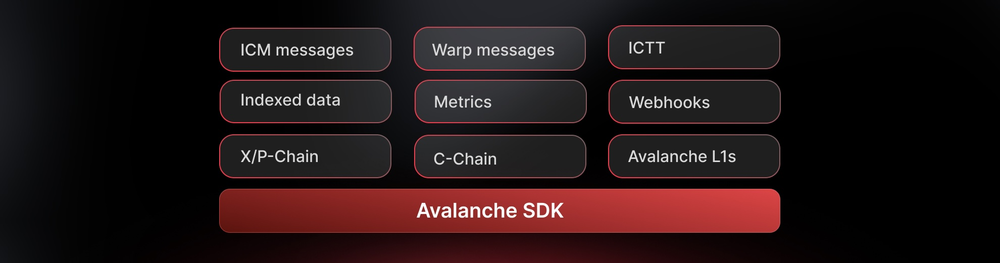

<div align="center">
  <h1>Avalanche SDK Typescript</h1>
  <h3>The official TypeScript SDK suite for building on Avalanche</h3>

  <p align="center">
      <a href="https://opensource.org/licenses/BSD-3-Clause" target="_blank" rel="noopener noreferrer">
    
  </a>
    <a href="https://nodejs.org" target="_blank" rel="noopener noreferrer">
      
    </a>
    <a href="https://www.typescriptlang.org/" target="_blank" rel="noopener noreferrer">
      
    </a>
  </p>
</div>

## Overview
Avalanche SDK for TypeScript is a modular suite for building on the Avalanche ecosystem. It covers:
- Direct chain access (RPC, wallets, transactions)
- Indexed data + metrics (Glacier Data API & Metrics API)
- Interchain messaging (ICM/Teleporter for cross–L1 apps)

This monorepo includes multiple specialized SDKs, each designed for specific use cases while maintaining consistency and interoperability.

> ⚠️ **Developer Preview**: This suite of SDKs is currently in beta and is subject to change. We'd love to hear about your experience! **[Please share your feedback here](https://forms.gle/kpunVSkA9nuCa1wM9).** Use in production at your own risk.

### 🎯 Which SDK Should I Use?

| SDK | Description |
|-----|-------------|
| `@avalanche-sdk/client` | Direct blockchain interaction - transactions, wallets, RPC calls |
| `@avalanche-sdk/chainkit` | Complete suite: Data, Metrics and Webhooks API |
| `@avalanche-sdk/interchain` | Send messages between Avalanche L1s using ICM/Teleporter |


## Available SDKs

### [Client SDK](./client/)
The main Avalanche client SDK for interacting with Avalanche nodes and building blockchain applications.

**Features:**
- Complete API coverage for P-Chain, X-Chain, and C-Chain
- Full <a href="https://viem.sh" target="_blank" rel="noopener noreferrer">viem</a> compatibility - anything you can do with viem works here
- TypeScript-first design with full type safety
- Abstractions over the JSON-RPC API to make your life easier
- Wallet integration and transaction management
- First-class APIs for interacting with Smart Contracts
- Retrieve balances and UTXOs for addresses
- Build, sign, and issue transactions to any chain
- Perform cross-chain transfers between X, P and C chains
- Add validators and delegators
- Create subnets and blockchains, convert subnets to L1s

### [ChainKit SDK](./chainkit/)
Combined SDK with full typed coverage of Avalanche Data (Glacier) and Metrics APIs.

**Features:**
- Full endpoint coverage for Glacier Data API and Metrics API
  - Glacier API: <a href="https://glacier-api.avax.network/api" target="_blank" rel="noopener noreferrer">https://glacier-api.avax.network/api</a>
  - Metrics API: <a href="https://metrics.avax.network/api" target="_blank" rel="noopener noreferrer">https://metrics.avax.network/api</a>
- Strongly-typed models, pagination helpers, and automatic retries/backoff
- High-level helpers for transactions, blocks, addresses, tokens, NFTs, and logs
- Metrics: network health, validator stats, throughput, latency, and block production analytics
- Webhooks-compatible payload shapes and utilities for signature verification
- Configurable base URL and API key authentication
- Request logging and middleware hooks for observability

### [Interchain SDK](./interchain/)
SDK for building cross-L1 applications and bridges.

**Features:**
- Type-safe ICM client for sending cross-chain messages
- Works seamlessly with wallet clients
- Built-in support for Avalanche C-Chain and custom subnets

## 🚀 Getting Started

### Prerequisites

- Node.js 20+ 
- npm, yarn, or pnpm
- TypeScript 5.0+ (recommended)

### Installation

#### Install SDKs
```bash
# Install only what you need
npm install @avalanche-sdk/client        # Core RPC functionality
npm install @avalanche-sdk/interchain    # Cross-chain messaging
npm install @avalanche-sdk/chainkit      # Indexed data, metrics, and webhooks
```

### Quick Examples

#### Client: Get AVAX Balance
```typescript
import { createAvalancheClient } from '@avalanche-sdk/client'
import { avalanche } from '@avalanche-sdk/client/chains'

const client = createAvalancheClient({
  chain: avalanche,
  transport: {
    type: "http"
  }
})

// Get account balance
const balance = await client.getBalance({ 
  address: '0xA0Cf798816D4b9b9866b5330EEa46a18382f251e',
})
```

<a href="https://github.com/ava-labs/avalanche-sdk-typescript/tree/main/client/examples">View more Client SDK examples →</a>

#### ChainKit: Get ERC20 balances

```typescript
import { Avalanche } from "@avalanche-sdk/chainkit";

const avalanche = new Avalanche({
  chainId: "43114",
});

async function run() {
  const result = await avalanche.data.evm.address.balances.listErc20({
    address: "0x8ae323046633A07FB162043f28Cea39FFc23B50A",
  });
  console.log(JSON.stringify(result, null, 2));
}

run();
```

<a href="https://github.com/ava-labs/avalanche-sdk-typescript/tree/main/chainkit/examples">View more ChainKit SDK examples →</a>

#### Interchain: Send cross-chain message
```typescript
import { createWalletClient, http } from "viem";
import { createICMClient } from "@avalanche-sdk/interchain";
import { privateKeyToAccount } from "viem/accounts";
import * as dotenv from 'dotenv';

// Load environment variables
dotenv.config();

// these will be made available in a separate SDK soon
import { avalancheFuji, dispatch } from "@avalanche-sdk/interchain/chains";

// Get private key from environment
const privateKey = process.env.PRIVATE_KEY;
if (!privateKey) {
  throw new Error("PRIVATE_KEY not found in environment variables");
}

// Load your signer/account
const account = privateKeyToAccount(privateKey as `0x${string}`);

// Create a viem wallet client connected to Avalanche Fuji
const wallet = createWalletClient({
  transport: http('https://api.avax-test.network/ext/bc/C/rpc'),
  account,
});

// Initialize the ICM client
const icmClient = createICMClient(wallet);

// Send a message across chains
async function main() {
  try {
    const hash = await icmClient.sendMsg({
      sourceChain: avalancheFuji,
      destinationChain: dispatch,
      message: 'Hello from Avalanche Fuji to Dispatch Fuji!',
    });
    console.log('Message sent with hash:', hash);
  } catch (error) {
    console.error('Error sending message:', error);
    process.exit(1);
  }
}

main();
```

<a href="https://github.com/ava-labs/avalanche-sdk-typescript/tree/main/interchain/examples">View more Interchain SDK examples →</a>

## 💡 What You Can Build

### Blockchain Infrastructure
- Custom RPC endpoints and API gateways
- Transaction broadcasting services
- Multi-chain wallet backends
- Account management systems

### Data Analytics & Monitoring
- Portfolio tracking applications
- Transaction history explorers
- Token balance dashboards
- Network health monitoring tools
- Validator performance trackers

### Real-Time Applications
- Price alert systems
- Transaction notification services
- Smart contract event monitors
- Blockchain activity feeds

### Cross-Chain Communication
- ICM message relayers
- Cross-L1 notification systems
- Interchain data synchronization
- Multi-chain coordination tools

### Developer Tools
- Smart contract debugging interfaces
- Transaction simulation tools
- Network testing utilities
- Blockchain data indexers

## Documentation

Each SDK includes comprehensive documentation:

- **[Client SDK Documentation](./client/README.md)** - Complete API reference and usage examples
- **[ChainKit SDK Documentation](./chainkit/README.md)** - Development utilities guide
- **[Interchain SDK Documentation](./interchain/README.md)** - Cross-chain development guide

## Examples

Each SDK includes practical examples demonstrating common use cases:

- **Client SDK Examples** - [View Examples](./client/examples/)
- **ChainKit SDK Examples** - [View Examples](./chainkit/examples/)
- **Interchain SDK Examples** - [View Examples](./interchain/examples/)

## Architecture

The Avalanche SDK TypeScript suite is designed with modularity in mind:

```
avalanche-sdk-typescript/
├── client/          # Main client SDK
├── chainkit/        # Development tools
└── interchain/      # Cross-chain SDK
```

Each SDK is:
- **Independent** - Can be used standalone
- **Modular** - Import only what you need
- **Type-safe** - Full TypeScript support
- **Well-documented** - Comprehensive guides and examples

## ⚡ Performance & Best Practices

### Optimization Tips
- Use the unified SDK for better tree-shaking when using multiple features
- Enable request batching for bulk operations
- Implement proper error handling and retries
- Cache frequently accessed data
- Use WebSocket connections for real-time data

### Security Considerations
- Never expose private keys in client-side code
- Use environment variables for sensitive data
- Validate all inputs before blockchain interactions
- Implement proper access controls
- Follow <a href="https://docs.avax.network/build/references/security" target="_blank" rel="noopener noreferrer">security best practices</a>

## 🔧 Troubleshooting

### Common Issues

| Issue | Solution |
|-------|----------|
| `Module not found` errors | Ensure you're using Node.js 20+ and have installed dependencies |
| TypeScript errors | Update to TypeScript 5.0+ and check `tsconfig.json` |
| Connection timeouts | Check network settings and RPC endpoint availability |
| Transaction failures | Verify gas settings and account balance |
| Type mismatches | Ensure all SDKs are on compatible versions |


## 🤝 Contributing

We welcome contributions! Please see our [Contributing Guide](CONTRIBUTING.md) for details.

### Quick Start for Contributors
```bash
# Clone the repository
git clone https://github.com/ava-labs/avalanche-sdk-typescript.git
cd avalanche-sdk-typescript

# Move to the SDK directory you want to work on
cd client

# Install dependencies
npm install

# Run tests
npm test

# Build all packages
npm run build
```

### Looking for Good First Issues?
Check out our <a href="https://github.com/ava-labs/avalanche-sdk-typescript/labels/good%20first%20issue" target="_blank" rel="noopener noreferrer">good first issues</a> to get started!

## 📞 Support

### 📖 Documentation & Resources
- <a href="https://build.avax.network/docs/api-reference" target="_blank" rel="noopener noreferrer">API Reference</a>
- <a href="https://docs.avax.network" target="_blank" rel="noopener noreferrer">Developer Docs</a>
- <a href="https://www.youtube.com/Avalancheavax" target="_blank" rel="noopener noreferrer">Video Tutorials</a>
- <a href="./examples">Code Examples</a>

### 👥 Community & Help
- <a href="https://discord.gg/avax" target="_blank" rel="noopener noreferrer">Discord</a> - Get real-time help
- <a href="https://t.me/+KDajA4iToKY2ZjBk" target="_blank" rel="noopener noreferrer">Telegram</a> - Join discussions
- <a href="https://x.com/AvaxDevelopers" target="_blank" rel="noopener noreferrer">Twitter</a> - Stay updated

### 🐛 Issue Tracking
- <a href="https://github.com/ava-labs/avalanche-sdk-typescript/issues/new?template=bug_report.md" target="_blank" rel="noopener noreferrer">Report a Bug</a>
- <a href="https://github.com/ava-labs/avalanche-sdk-typescript/issues/new?template=feature_request.md" target="_blank" rel="noopener noreferrer">Request a Feature</a>
- <a href="https://github.com/ava-labs/avalanche-sdk-typescript/issues" target="_blank" rel="noopener noreferrer">View All Issues</a>

### 📮 Direct Support
- Technical Issues: <a href="https://github.com/ava-labs/avalanche-sdk-typescript/issues" target="_blank" rel="noopener noreferrer">GitHub Issues</a>
- Security Issues: security@avalabs.org
- General Inquiries: data-platform@avalabs.org

## 🔄 Release Notes

See [CHANGELOG.md](CHANGELOG.md) for a detailed version history.

## 📄 License

This project is licensed under the BSD 3-Clause License - see the [LICENSE](LICENSE) file for details.

---

<div align="center">
  <h3>🏔️ Built with ❤️ by the Avalanche Team</h3>
  
  <a href="https://www.avax.network/" target="_blank" rel="noopener noreferrer">Website</a> • 
  <a href="https://docs.avax.network/" target="_blank" rel="noopener noreferrer">Documentation</a> • 
  <a href="https://medium.com/@avaxdevelopers" target="_blank" rel="noopener noreferrer">Blog</a> • 
  <a href="https://github.com/ava-labs" target="_blank" rel="noopener noreferrer">GitHub</a>
</div>